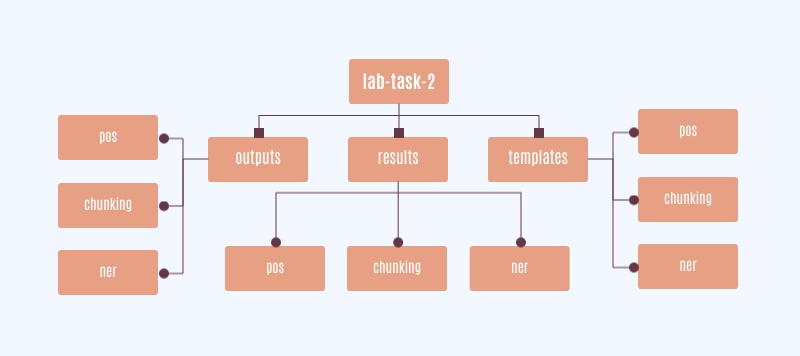

# Lab Task - 2: Part-of-Speech Tagging, Chunking and Named Entity Recognition using CRF++

## Author Details

```
Name - Shivani
Username - grad-date
Roll No - 19074017
```


## Part of Speech (PoS) Tagging


POS or part-of-speech tagging is the technique of assigning special labels to each token in text, to indicate its part of speech, and usually even other grammatical connotations, which can later be used in text analysis algorithms. For example, for the sentence -

```
She is reading a book.
```
‘She’ would the POS tag of pronoun, ‘is’ would get an article tag, ‘reading’ a verb tag, ‘a’ would get an article tag and ‘book’ would get a noun tag. We can then do a search for all verbs which would pull up the word reading, and also use these tags in other algorithms.

### How can POS tags be used?
- Named entity recognition (NER)
- Statistical language models based on the frequencies of different tags
- Text generation by models trained with POS tagged datasets
- Pattern identification in corpus datasets
- Distinguishing between different occurrences of the same word, for example, between the word ‘time’ when it is used as a verb or a noun
- Sentiment analysis


## Chunking


Chunking is a process of extracting phrases from unstructured text, which means analyzing a sentence to identify the constituents(Noun Groups, Verbs, verb groups, etc.) However, it does not specify their internal structure, nor their role in the main sentence.
It works on top of POS tagging. It uses POS-tags as input and provides chunks as output.

```
In short, Chunking means grouping of words/tokens into chunks.

Chunking can break sentences into phrases that are more useful than individual words and yield meaningful results.

Chunking is very important when you want to extract information from text such as locations, person names. (entity extraction)
```

A sentence typically follows a hierarchical structure consisting of the following components.

**sentence → clauses → phrases → words**

Group of words make up phrases and there are five major categories.
- Noun Phrase (NP)
- Verb phrase (VP)
- Adjective phrase (ADJP)
- Adverb phrase (ADVP)
- Prepositional phrase (PP)


## Named Entity Recognition (NER)


Named Entity Disambiguation (NED) is a research area of Natural Language Processing (NLP) focused on linking a reference within a unit of text to its corresponding entity in some knowledge base, such as a node in a knowledge graph. Accurate NED is critical for modern technology companies to process and link documents, reports, press releases and other written material with meaningful contextual information to entries in knowledge bases, in order to improve understanding of an entity for research and commercial purposes.

While traditional NLP approaches to the problem have focused on early stages of such data pipelines — like Named Entity Recognition, string normalization and context windows — recent research has started to focus on comparing named entities themselves within a contextual window — such as a single sentence — to produce better link predictions. Identifying the strength of relationship between named entities within a contextual window involves calculating what we refer to as Named Entity Congruence, or the contextual and semantic relatedness of named entities. In partnership with Kensho Technologies, we develop several methodologies for incorporating congruence in NED using open-source Wikimedia data, and demonstrate its potential to improve performance on entity disambiguation tasks.

Named Entity Recognition identifies within a unit of text the word or words that represent an entity or object — such as names, organizations, locations, or other proper nouns.

---


## Tool Used

### CRF++
CRF++ is a simple, customizable, and open source implementation of Conditional Random Fields (CRFs) for segmenting/labeling sequential data. CRF++ is designed for generic purpose and will be applied to a variety of NLP tasks, such as Named Entity Recognition, Information Extraction and Text Chunking. Some features:

- Can redefine feature sets
- Written in C++ with STL
- Fast training based on LBFGS, a quasi-newton algorithm for large scale numerical optimization problem
- Less memory usage both in training and testing
- Encoding/decoding in practical time
- Can perform n-best outputs
- Can perform single-best MIRA training
- Can output marginal probabilities for all candidates
- Available as an open source software


## Dataset Used

CoNLL shared tasks 2000 and 2002 for Chunking and Named Entity Recognition. For POS tagging, extracted the dataset from the Chunking dataset by writing a simple program as the Chunking dataset has the POS tags.


## Directory Format


- Each of the sub-folders contain three files of respective types.
- All the [models](https://drive.google.com/drive/folders/1y2Yo9_w61rncmbvDeRvIpgArMfKGONkH?usp=sharing) are located here.
- Access the [datasets](https://drive.google.com/drive/folders/1C8D2Uasa6I0LaogPb5PkiQgK9mtNeDYB?usp=sharing) here.


## Sources of Error

- Model trained on a particular dataset
- Not involving text from all over the world (which is obviously not possible)
- Feature combination
- Nothing in world is 100% accurate.