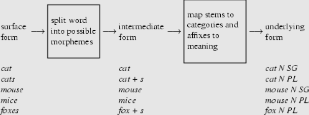

# Lab Task-5: Isolated Word Morphological Analysis


## Author Details

```
Name - Shivani
Username - grad-date
Roll No - 19074017
```


## Morphology: the internal structure of words


Morphology is studying the internal structure of words and forms a core part of linguistic study today.

The term morphology is Greek and is a makeup of morph- meaning ‘shape, form’, and -ology, which means ‘the study of something’.

Words are built up of minimal meaningful elements called morphemes. E.g.
```
played = play-ed
cats = cat-s
unfriendly = un-friend-ly
```

Two types of morphemes:
```
Stems: play, cat, friend
Affixes: -ed, -s, un-, -ly
```

Two main types of affixes:
```
Prefixes precede the stem: un
Suffixes follow the stem: -ed, -s, un-, -ly
```


## Morphological Analysis



Morphological analysis (MA) is a method for identifying, structuring and investigating the total set of possible relationships in a given multidimensional problem complex. MA allows small groups of subject specialists to define, link, and internally evaluate the parameters of complex problem spaces, creating a solution space and a flexible inference model. MA has been applied successfully in strategic planning and decision support in various domains, such as governance of technological development and modelling the Bioethics of drug redevelopment, which were reported more comprehensively by Ritchey.

Morphological analysis:
```
token --> lemma + part of speech + grammatical features
```

Examples:
```
cats --> cat + N + plur
played --> play + V + past
katternas --> katt + N + plur + def + gen
```

Often non-deterministic (more than one solution):
```
plays --> play+N+plur
plays --> play+V+3sg
```

Lemmatization:
```
token --> lemma
```

Note:
- The lemma is the canonical form found in dictionaries
- Affixation sometimes involves spelling changes (knife – knives)
- Inflection does not always involve affixation (mouse – mice)


## Datasets: downloaded from

- Hindi: `http://ltrc.iiit.ac.in/hutb_release/HDTB_pre_release_version-0.05.zip`
- Urdu: `http://ltrc.iiit.ac.in/hutb_release/UDTB_pre_release_version-0.01.zip`


## Directory Structure

### [.ipynb file](morphological_analysis.ipynb)
This file is the backbone of the entire lab task which holds training, testing and prediction for morphological analysis of both the languages (Urdu followed by Hindi).

### Graphs
[Hindi](graphs/hindi)<br>
[Urdu](graphs/urdu)

Each folder contains graphs of following features:
- POS
- gender
- singular/plural
- person
- case 
- tense-aspect-mood (TAM)

### Outputs
[Hindi](outputs/hindi)<br>
[Urdu](outputs/urdu) <br>

Each folder contains:
- feature_0: POS
- feature_1: gender
- feature_2: singular/plural
- feature_3: person
- feature_4: case 
- feature_5: tense-aspect-mood (TAM)
- predictions.txt
- words.txt


## Result

| Language | Average Precision Score | Loss | Accuracy | Validation Accuracy | 
| :------: | :---------------------: | :--: | :------: | :-----------------: |
| Hindi | 0.6731138981899432 | 0.79342 | 0.9862 | 0.9826 | 
| Urdu | 0.7293645244399081 | 1.34880 |0.9697 | 0.9758 | 


## Note:
- `Loss`, `Accuracy` and `Validation Accuracy` from the latest epochs of respective languages.
- To get models [click here](https://drive.google.com/drive/folders/1XwdEBscG7yFgY4sGEIEmYq9w3aCPkuGw?usp=sharing).