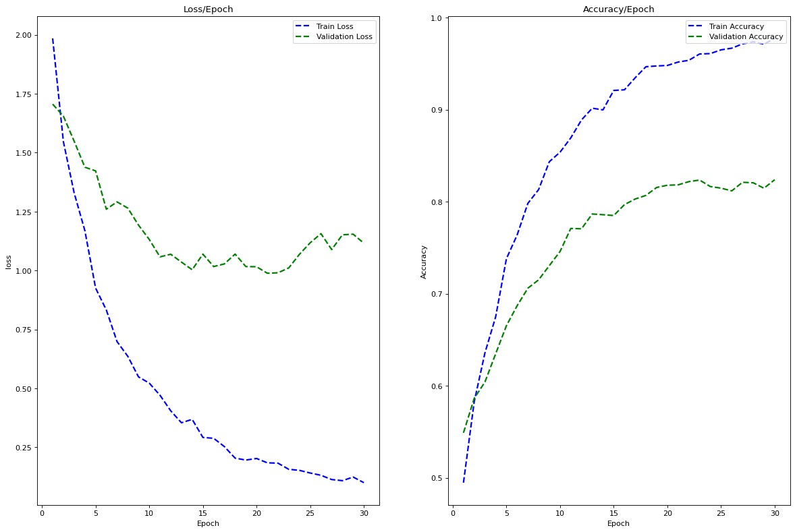
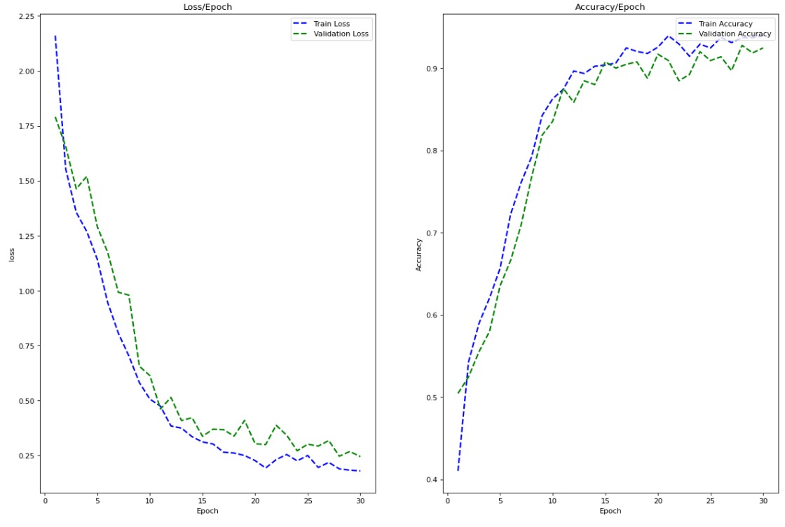
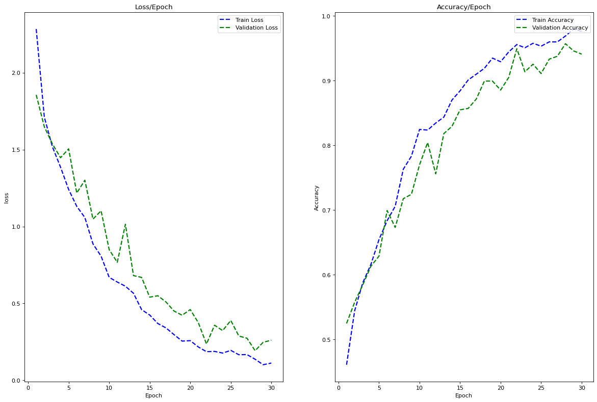
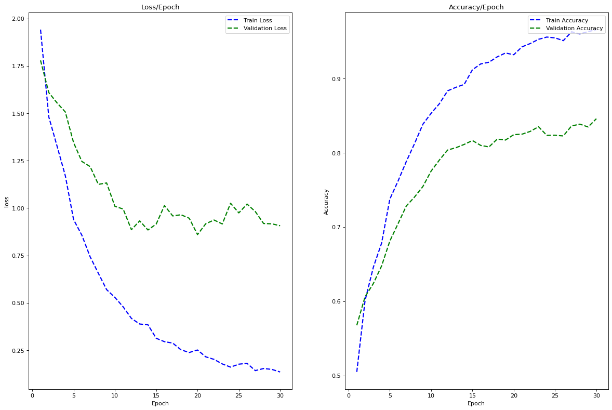

# Lab Task-6: Isolated Word Morphological Generation


## Author Details

```
Name - Shivani
Username - grad-date
Roll No - 19074017
```


## Morphology: the internal structure of words


Morphology is studying the internal structure of words and forms a core part of linguistic study today.

The term morphology is Greek and is a makeup of morph- meaning ‘shape, form’, and -ology, which means ‘the study of something’.

Words are built up of minimal meaningful elements called morphemes. E.g.
```
played = play-ed
cats = cat-s
unfriendly = un-friend-ly
```

Two types of morphemes:
```
Stems: play, cat, friend
Affixes: -ed, -s, un-, -ly
```

Two main types of affixes:
```
Prefixes precede the stem: un
Suffixes follow the stem: -ed, -s, un-, -ly
```


## Morphological Generation

Morphological Inflection is the task of generating a target (inflected form) word from a source word (base form), given a morphological attribute, e.g. number, tense, and person etc. It is useful for alleviating data sparsity issues in translating morphologically rich languages. The transformation from a base form to an inflected form usually includes concatenating the base form with a prefix or a suffix and substituting some characters. For example, in Spanish:
```
Lemma: abajar
Features: V;IND;PRS;1;PL
Inflected form: abajamos
```


## Datasets: downloaded from
https://github.com/sigmorphon/2019/tree/master/task1


## Plots:

### German


### Middle-High-German


### Bengali


### Hindi



## Result: 

| Language | Training Loss | Training Accuracy | Validation Loss | Validation Accuracy | 
|---|---|---|---|---|
| German | 0.177723 | 0.950101 | 0.160316 | 0.958387 | 
| Middle-High-German | 0.317732 | 0.890997 | 0.474133 | 0.849231 | 
| Bengali | 0.111612 | 0.976301 | 0.260255 | 0.941111 | 
| Hindi | 0.135029 | 0.965805  | 0.906626 | 0.845778 |


## Note
To get models [click here](https://drive.google.com/drive/folders/1_hVY8oQvGMzPkvC6KCI5FU5GcOrD0vCZ?usp=sharing).