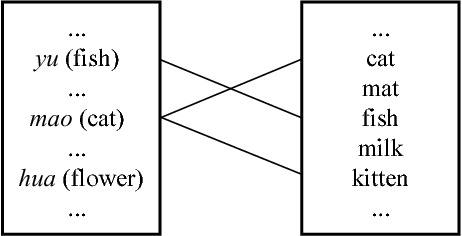

# Lab Task 7: Bilingual Dictionary Induction from Comparable Corpora


## Author Details

```
Name - Shivani
Username - grad-date
Roll No - 19074017
```


## Introduction

> Cross-lingual word embeddings learning has triggered great attention in recent years, and several bilingual supervised and unsupervised alignment methods have been proposed so far.

In the framework of machine translation, the extraction of bilingual dictionaries from parallel corpora has been conducted very successfully. However, on the other hand, human second language acquisition appears not to be based on parallel data. This means that there must be a way of acquiring and relating lexical knowledge across two or more languages without the use of parallel data. 

It has been suggested that it may be possible to extract multilingual lexical knowledge from comparable rather than from parallel corpora. From a theoretical perspective, this suggestion may lead to advances in understanding human second language acquisition. From a practical perspective, as comparable corpora are available in much larger quantities than parallel corpora, this approach might help relieve the data acquisition bottleneck, which tends to be especially severe when dealing with language pairs involving low resource languages.




## Solution

A well-established practical task to approach this topic is bilingual lexicon extraction from comparable corpora. Typically, it aims to extract word translations from comparable corpora, where a given source word may receive multiple translations. Note that, to reflect the tabular format used, multiple translations of the same source word are listed in separate rows. E.g.

| Source (English) | Target (German) |
|:--:|:--:|
| dog | hund |
| doctor | doktor |
| doctor | arzt |
| lady | dame |
| lady | frau |
| mountain | berg |
| work | arbeit |


## To Do
Work on one language pair in both directions (English-German and German-English):
1. Using Skip-gram embedding and the VecMap library, generate a bilingual dictionary.
2. Using fastText embedding and the VecMap library, again do the same and compare the results with the above implementation.


## Directory Structure

The main folder of this repo contains only a [Jupiter Notebook](bilingual-dictionary.ipynb), which holds the entire implementation of the lab task, (as the corpora and embeddings are quite huge in size to put in here, so attaching the links to google drive).

**Datasets:** (in the outer folder - [Lab7](https://drive.google.com/drive/folders/1K7yQ7rNqCvNauDpXp5tcsPN3LngNaZil?usp=sharing), contains 8 files)
- fastText embeddings of English and German
- word2vec (SkipGram) embeddings of English and German
- Train data for English-German and German-English
- Test data for English-German and German-English

**Models:** (generated inside the inner folder - [vecmap](https://drive.google.com/drive/folders/1-tzrp2ytGquTYuTv7cVqsIge1HoxTsiP?usp=sharing), contains 8 files)
- Source Mapped Embeddings (Dictionaries) for English-German and German-English (fastText and word2vec)
- Target Mapped Embeddings (Dictionaries) for English-German and German-English (fastText and word2vec)


## Observations and Results

**1. Using SkipGram**

| Language Pair | Accuracy (%) | Coverage (%) | 
|:---:|:---:|:---:|
| German-English | 63.90 | 81.30 | 
| English-German | 28.74 | 90.30 | 

**2. Using fastText**

| Language Pair | Accuracy (%) | Coverage (%) | 
|:---:|:---:|:---:|
| German-English | 86.61 | 87.00 | 
| English-German | 58.55 | 94.10 |


## Conclusion

The accuracy of the dictionaries generated from using the Word2Vec embeddings are much less than that is received from using the Fasttext embeddings. There are 2 main reasons for this:

1. Word2vec treats each word in a corpus like an atomic entity and generates a vector for each word, thus Word2Vec treats words as the smallest unit to train on. FastText — which is essentially an extension of the word2vec model — treats each word as composed of character n-grams. So the vector for a word is made of the sum of this character n-grams. The key difference between FastText and Word2Vec is the use of n-grams. Word2Vec learns vectors only for complete words found in the training corpus. FastText, on the other hand, learns vectors for the n-grams that are found within each word, as well as each complete word. N-gram feature is the most significant improvement in FastText, it somewhat even solves OOV (Out-of-Vocabulary) issue.

2. The corpus, on which word2vec embeddings were trained, was comparitively small due to computational inefficiencies, the embeddings generated were not that good and so the accuracy of the dictionaries generated was less.
